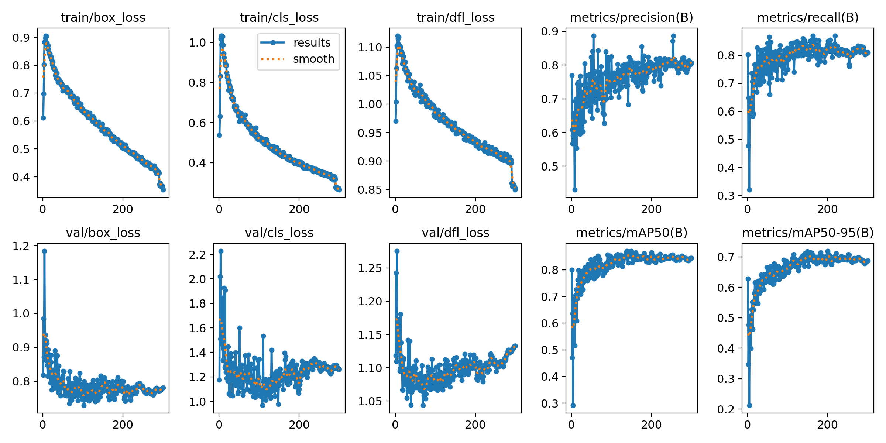
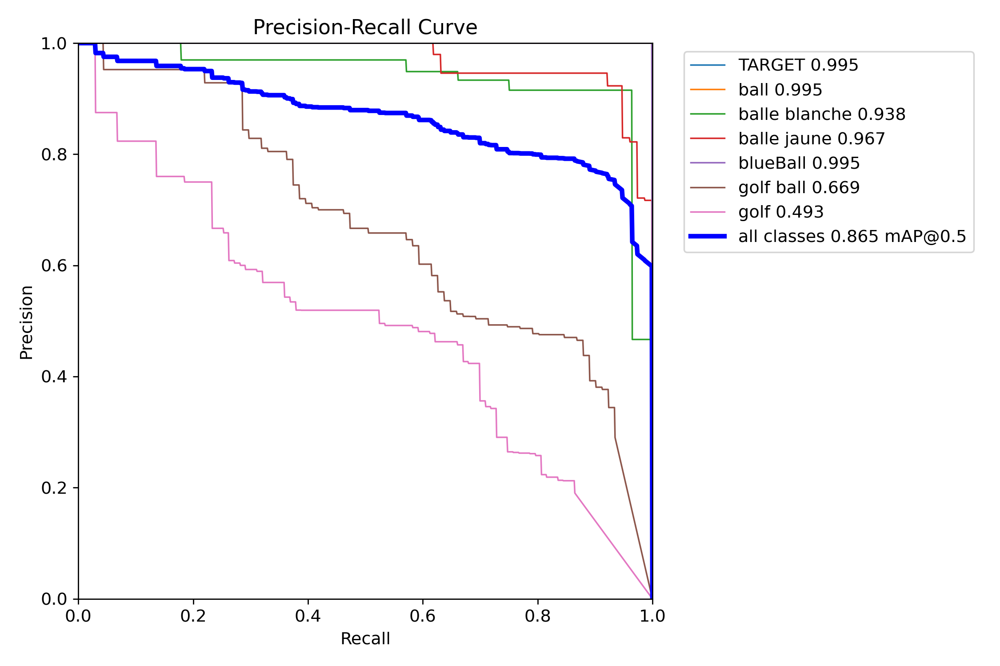

# ⛳ Golf Ball Detector

YOLO 객체 탐지 모델을 활용하여 이미지와 영상에서  
골프공의 위치를 탐지하는 컴퓨터 비전 프로젝트입니다.

사용자 정의 데이터셋으로 모델을 학습하고, 탐지된 객체의 위치를  
바운딩 박스와 Confidence Score로 표시하도록 구현했습니다.

<p>
  
  
  
  
  
</p>

---

## 📌 Project Overview

골프공은 크기가 작고 잔다운 배경이나 밝은 물체와 색상이 유사해  
일반적인 객체보다 정확하게 탐지하기 어려울 수 있습니다.

이 프로젝트에서는 다양한 크기와 배경의 골프공 이미지를 활용하여  
YOLO 객체 탐지 모델을 학습했습니다.

학습된 모델은 다음 환경에서 골프공을 탐지할 수 있습니다.

- 잔디 위에 놓인 골프공
- 실내에 놓인 골프공
- 화면에서 작게 보이는 골프공
- 여러 개가 동시에 배치된 골프공
- 흰색 및 색상이 있는 공
- 이미지 및 영상 프레임

---

## 🎯 Project Goals

- 사용자 정의 골프공 데이터셋 구축
- YOLO 기반 객체 탐지 모델 학습
- 작은 골프공 객체의 위치 탐지
- 이미지와 영상에 대한 추론 기능 구현
- 모델의 Precision, Recall, mAP 성능 분석
- 다른 환경에서도 실행할 수 있는 프로젝트 구조 구성
- 학습과 추론 코드의 재사용성 개선

---

## ✨ Main Features

### 🤖 YOLO 모델 학습

- 사용자 정의 데이터셋 학습
- 사전 학습된 YOLO 가중치 활용
- Epoch, Batch Size, Image Size 설정 지원
- CPU 또는 GPU 자동 선택
- 학습 결과 자동 저장
- 중단된 학습 재개 기능

### 🔍 객체 탐지

- 이미지 속 골프공 탐지
- 영상 속 골프공 탐지
- 폴더 단위 일괄 추론
- 웹캠 실시간 탐지
- URL 및 스트리밍 입력 지원
- Confidence Threshold 설정
- IoU Threshold 설정
- 탐지 결과 이미지 저장
- 객체 좌표와 Confidence Score 저장

### 📊 모델 평가

- Precision 분석
- Recall 분석
- mAP50 분석
- mAP50-95 분석
- Training Loss 분석
- Validation Loss 분석
- Precision-Recall Curve 확인
- 클래스별 Confusion Matrix 확인

---

## 🛠 Tech Stack

### AI & Computer Vision

<p>
  
  
  
  
</p>

### Language

<p>
  
</p>

### Development Tools

<p>
  
  
  
  
</p>

---

## 🔄 Model Development Flow

```text
골프공 이미지 수집
        ↓
객체 위치 라벨링
        ↓
학습·검증 데이터 분리
        ↓
data.yaml 작성
        ↓
YOLO 모델 학습
        ↓
학습 결과 및 성능 평가
        ↓
best.pt 체크포인트 선택
        ↓
이미지·영상 객체 탐지
        ↓
탐지 결과 분석
```

---

## 📁 Project Structure

```text
GolfBallDetector/
├── assets/
│   ├── detection-result.jpg
│   ├── PR_curve.png
│   └── results.png
│
├── README.md
├── requirements.txt
├── data.yaml
├── train.py
├── resume_training.py
├── predict.py
└── .gitignore
```

### 주요 파일 설명

| 파일 | 설명 |
|---|---|
| `train.py` | 새로운 YOLO 모델 학습 |
| `resume_training.py` | `last.pt` 체크포인트에서 학습 재개 |
| `predict.py` | 이미지, 영상, 폴더, URL 및 웹캠 객체 탐지 |
| `data.yaml` | 데이터셋 경로와 클래스 정보 설정 |
| `requirements.txt` | 프로젝트 실행에 필요한 Python 패키지 목록 |
| `assets/` | README에 사용되는 탐지 결과와 성능 그래프 |

데이터셋, 학습 결과 폴더 및 모델 가중치는 파일 크기가 크기 때문에  
GitHub 저장소에 직접 포함하지 않습니다.

---

## 🗂 Dataset Structure

프로젝트에서는 다음과 같은 YOLO 데이터셋 구조를 사용합니다.

```text
datasets/
└── golf-ball/
    ├── images/
    │   ├── train/
    │   ├── val/
    │   └── test/
    │
    └── labels/
        ├── train/
        ├── val/
        └── test/
```

이미지와 라벨 파일은 이름이 같아야 합니다.

```text
images/train/golf_001.jpg
labels/train/golf_001.txt
```

YOLO 라벨 파일은 다음 형식을 사용합니다.

```text
class_id center_x center_y width height
```

예시:

```text
0 0.512 0.468 0.084 0.091
```

좌표와 크기는 이미지 전체 크기를 기준으로  
`0`부터 `1` 사이의 값으로 정규화합니다.

---

## ⚙️ Dataset Configuration

`data.yaml` 예시는 다음과 같습니다.

```yaml
path: ./datasets/golf-ball

train: images/train
val: images/val
test: images/test

names:
  0: golf-ball
```

개인 컴퓨터의 절대 경로 대신 프로젝트 기준 상대 경로를 사용합니다.

---

## 🚀 Getting Started

### 1. 저장소 복제

```bash
git clone https://github.com/dongseop9907/GolfBallDetector.git
cd GolfBallDetector
```

### 2. 가상환경 생성

Windows:

```bash
python -m venv .venv
.venv\Scripts\activate
```

macOS 또는 Linux:

```bash
python3 -m venv .venv
source .venv/bin/activate
```

### 3. 패키지 설치

```bash
pip install -r requirements.txt
```

---

## 🏋️ Model Training

### 기본 설정으로 학습

```bash
python train.py
```

기본 설정은 프로젝트 최상위의 `data.yaml`을 사용합니다.

### Epoch 변경

```bash
python train.py --epochs 100
```

### 데이터셋 파일 지정

```bash
python train.py --data data.yaml
```

### Batch Size와 Image Size 변경

```bash
python train.py --batch 16 --imgsz 640
```

### 모델 지정

```bash
python train.py --model yolov8m.pt
```

### 전체 옵션 예시

```bash
python train.py ^
  --data data.yaml ^
  --model yolov8m.pt ^
  --epochs 100 ^
  --batch 16 ^
  --imgsz 640
```

Windows 명령 프롬프트에서는 `^`를 이용해 명령어를 여러 줄로 작성할 수 있습니다.

---

## 🔁 Resume Training

중단된 학습을 `last.pt` 체크포인트에서 이어서 진행할 수 있습니다.

기본 체크포인트 경로를 사용하는 경우:

```bash
python resume_training.py
```

다른 위치의 체크포인트를 사용하는 경우:

```bash
python resume_training.py --checkpoint "path/to/last.pt"
```

학습 재개에는 일반적으로 마지막 학습 상태가 저장된  
`last.pt` 파일을 사용합니다.

---

## 🔍 Run Prediction

### 이미지 탐지

```bash
python predict.py ^
  --weights "path/to/best.pt" ^
  --source "sample.jpg"
```

### 영상 탐지

```bash
python predict.py ^
  --weights "path/to/best.pt" ^
  --source "sample.mp4"
```

### 폴더 내 이미지 일괄 탐지

```bash
python predict.py ^
  --weights "path/to/best.pt" ^
  --source "images/"
```

### 웹캠 실시간 탐지

```bash
python predict.py ^
  --weights "path/to/best.pt" ^
  --source 0 ^
  --show
```

### Confidence Threshold 변경

```bash
python predict.py ^
  --weights "path/to/best.pt" ^
  --source "sample.jpg" ^
  --conf 0.5
```

### 탐지 좌표와 Confidence Score 저장

```bash
python predict.py ^
  --weights "path/to/best.pt" ^
  --source "sample.jpg" ^
  --save-txt ^
  --save-conf
```

기본 탐지 결과는 다음 경로에 저장됩니다.

```text
runs/detect/golf-ball-predict/
```

---

## 🖼 Detection Results

학습된 YOLO 모델을 이용하여 검증 이미지에서 골프공을 탐지한 결과입니다.

<p align="center">
  
</p>

모델은 잔디, 실내 및 다중 객체 환경에서 객체의 위치를 탐지하고,  
바운딩 박스와 Confidence Score를 표시합니다.

일부 객체가 서로 다른 클래스명으로 표시되는 문제는  
아래의 데이터셋 한계 부분에서 설명합니다.

---

## 📊 Model Performance

모델은 총 **300 Epoch** 동안 학습했습니다.

### Training Configuration

| Item | Setting |
|---|---:|
| Epochs | 300 |
| Batch Size | 16 |
| Image Size | 640 |
| Optimizer | Auto |
| Pretrained | True |
| Validation | True |
| Training Device | CPU |
| IoU Threshold | 0.7 |

### Final Epoch Metrics

300번째 Epoch 기준 결과입니다.

| Metric | Result |
|---|---:|
| Precision | 0.807 |
| Recall | 0.811 |
| mAP50 | 0.844 |
| mAP50-95 | 0.687 |

### Best Metrics During Training

| Metric | Best Result | Epoch |
|---|---:|---:|
| Precision | 0.887 | 254 |
| Recall | 0.870 | 163 |
| mAP50 | 0.870 | 149 |
| mAP50-95 | 0.719 | 200 |

수치는 학습 과정에서 생성된 `results.csv`를 기준으로 작성했습니다.

### Training Results

<p align="center">
  
</p>

학습이 진행되면서 Training Loss가 감소했으며,  
Precision, Recall, mAP50 및 mAP50-95가 점진적으로 향상되었습니다.

후반부에는 일부 Validation Loss가 다시 증가하는 경향이 나타나므로,  
추후 Early Stopping과 데이터셋 정제를 통해 일반화 성능을 개선할 예정입니다.

### Precision-Recall Curve

<p align="center">
  
</p>

Precision-Recall Curve에 표시된 선택 체크포인트의  
전체 클래스 기준 `mAP@0.5`는 약 `0.865`입니다.

`results.csv`의 최종 및 최고 mAP50 값과 PR Curve의 값은  
평가 시점과 사용된 체크포인트에 따라 차이가 발생할 수 있습니다.

---

## ⚠️ Dataset Limitations

현재 학습 결과에는 유사한 골프공 객체가 서로 다른 클래스 이름으로  
분리되어 있는 문제가 있습니다.

확인된 클래스 이름은 다음과 같습니다.

```text
Ball
Chromesoft_x_Is
Golf-ball
Prov1
Prov1x
TARGET
Tp5
Tp5x
ball
balle blanche
balle jaune
blueBall
golf ball
golf
golfball
```

동일하거나 유사한 객체가 여러 클래스명으로 분리되어 학습되면서  
다음 문제가 발생할 수 있습니다.

- 같은 골프공이 서로 다른 클래스로 탐지됨
- 클래스별 데이터 수가 불균형해짐
- Confusion Matrix에서 클래스 간 혼동이 증가함
- 전체 성능 지표의 해석이 어려워짐
- 실제 서비스에서 일관된 클래스명을 제공하기 어려움

향후 모든 골프공 라벨을 하나의 `golf-ball` 클래스로 통합하고,  
중복 이미지와 잘못된 라벨을 정제한 뒤 모델을 다시 학습할 예정입니다.

현재 성능 수치는 초기 데이터셋 구조를 기반으로 한 실험 결과입니다.

---

## 📦 Model Download

학습된 YOLO 모델은 GitHub Releases에서 내려받을 수 있습니다.

<p>
  <a href="https://github.com/dongseop9907/GolfBallDetector/releases/latest/download/best.pt">
    
  </a>
</p>

### 모델 실행

다운로드한 `best.pt` 파일을 프로젝트의 `weights` 폴더에 저장합니다.

```text
GolfBallDetector/
└── weights/
    └── best.pt
```

이미지 탐지:

```bash
python predict.py --weights weights/best.pt --source sample.jpg
```

영상 탐지:

```bash
python predict.py --weights weights/best.pt --source sample.mp4
```

웹캠 탐지:

```bash
python predict.py --weights weights/best.pt --source 0 --show
```

> 현재 공개된 모델은 초기 통합 데이터셋으로 학습되어 일부 클래스명이  
> 통일되지 않은 한계가 있습니다.

---

## ⚠️ Model Files

학습된 모델 파일인 `best.pt`와 `last.pt`는 용량이 크기 때문에  
GitHub 저장소에 직접 포함하지 않습니다.

각 모델 파일의 용도는 다음과 같습니다.

| File | Purpose |
|---|---|
| `best.pt` | 검증 성능이 가장 좋았던 모델의 추론 및 평가 |
| `last.pt` | 마지막 Epoch 상태에서 학습 재개 |

모델 파일을 배포할 경우 다음 방법을 사용할 수 있습니다.

- GitHub Releases
- Google Drive
- Hugging Face
- 외부 파일 다운로드 링크

---

## 🔒 Git Ignore

다음 파일과 폴더는 Git 추적 대상에서 제외합니다.

```gitignore
# Python
__pycache__/
*.pyc
*.pyo
*.pyd

# Virtual environment
venv/
.venv/

# Environment variables
.env
.env.*

# IDE
.idea/
*.iml
.vscode/

# YOLO results and models
runs/
runs.zip
*.pt

# Dataset
datasets/

# Operating system
.DS_Store
Thumbs.db
```

---

## 👨‍💻 My Role

- 골프공 이미지 데이터 수집
- 데이터셋 통합 및 구성
- 객체 위치 라벨링
- 학습 및 검증 데이터 분리
- YOLO 모델 학습
- 학습 파라미터 설정
- 중단된 학습 재개 기능 구성
- 이미지 및 영상 객체 추론
- 모델 성능 지표 분석
- 탐지 결과 분석
- 개인 컴퓨터 절대 경로 제거
- 학습·추론 코드 모듈화
- GitHub 프로젝트 구조 정리
- README 및 실행 방법 작성

---

## 💡 Troubleshooting

### 데이터셋을 찾을 수 없는 경우

다음 내용을 확인합니다.

- `data.yaml` 파일이 존재하는지
- `path`가 실제 데이터셋 위치와 일치하는지
- `images/train` 폴더가 존재하는지
- `images/val` 폴더가 존재하는지
- 이미지와 라벨 파일명이 동일한지

### 모델 파일을 찾을 수 없는 경우

`--weights` 또는 `--checkpoint`에 입력한 경로에  
실제 `.pt` 파일이 존재하는지 확인합니다.

```bash
python predict.py --weights "path/to/best.pt" --source "sample.jpg"
```

### 패키지를 찾을 수 없는 경우

가상환경을 활성화하고 패키지를 다시 설치합니다.

```bash
pip install -r requirements.txt
```

### CUDA를 사용할 수 없는 경우

CUDA가 설치되지 않았거나 지원 GPU가 없는 경우  
모델은 CPU에서 실행될 수 있습니다.

CPU 학습은 GPU 학습보다 시간이 오래 걸릴 수 있습니다.

### GitHub 파일 크기 오류가 발생하는 경우

`.pt`, `runs.zip`, 데이터셋 압축 파일이 Git에 포함되어 있는지 확인합니다.

이미 Git이 추적하고 있다면 다음 명령어로 추적 대상에서 제거합니다.

```bash
git rm --cached "파일명"
```

그다음 `.gitignore`에 해당 파일이나 확장자를 추가합니다.

---

## ✅ Current Development Status

### 완료

- [x] 사용자 정의 데이터셋 구성
- [x] YOLO 모델 학습
- [x] 300 Epoch 학습
- [x] 학습 재개 스크립트 작성
- [x] 이미지 및 영상 추론 스크립트 작성
- [x] 모델 성능 그래프 분석
- [x] 탐지 결과 이미지 추가
- [x] 절대 경로 제거
- [x] Python 의존성 파일 작성
- [x] 데이터셋 설정 예시 작성
- [x] IDE 및 대용량 파일 제외 설정

### 개선 예정

- [ ] 모든 골프공 클래스를 하나로 통합
- [ ] 잘못된 라벨 및 중복 이미지 제거
- [ ] 정제된 데이터셋으로 재학습
- [ ] 실제 촬영 이미지 기반 추가 평가
- [ ] 단일 이미지 탐지 결과 추가
- [ ] 실시간 웹캠 탐지 테스트
- [ ] 모델 가중치 외부 배포
- [ ] 추론 속도 측정
- [ ] 테스트 코드 작성
- [ ] 모바일 애플리케이션 연동

---

## 📚 Future Improvements

- 모든 골프공 클래스를 `golf-ball` 하나로 통합
- 데이터셋 이미지 수 확대
- 데이터셋 클래스 불균형 개선
- 잘못된 바운딩 박스 수정
- 촬영 거리와 조명 환경 다양화
- 작은 객체 탐지 성능 개선
- 실제 골프장 환경 데이터 추가
- Early Stopping 적용
- Hyperparameter Tuning
- 모델 경량화
- 실시간 카메라 탐지 기능 구현
- 골프공 이동 경로 추적
- React Native 애플리케이션 연동
- 학습된 모델의 API 배포
- 
